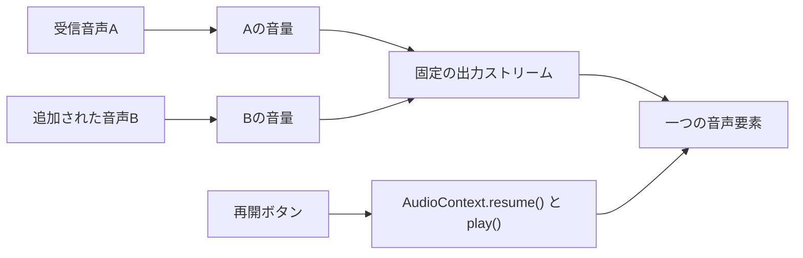

# スピーカー追加・交代時の音声断とiPhoneの再生再開要求

調査日: 2026-10-08（日本時間）。対象は `develop` の `5d23778d84`。元の作業ツリーにある未コミット変更は取り込まず、このコミットから専用ブランチを作成した。

報告された症状は「参加者がスピーカーに上がるたびに誰かが聞こえなくなる」「iPhoneで、誰かがスピーカーに上がるたびに『音声再生を再開する』が必要になる」の二つ。

## 調査で確認できた原因

音声が消える実装上の問題を二つ、修正前のコードで再現した。ただし、報告時の端末情報、SDP、Cloudflareの応答、ログはないため、実際の各発生事例を一つの原因に断定することはできない。

`CallsMediaController.reconcileNow()` は、一覧から消えたpublicationの受信トラックに `receiver.track.stop()` を呼んでいた。`stop()` はトラックを終了させる操作なので、同じ受信トラックを次のpublicationに割り当てても復活しない。スピーカー退出・降壇後にSFUが同じMIDの受信口を再利用するケースでは、新しい話者の音声が再生できなくなる。回帰テストで「話者Aを購読 → Aのpublicationが消える → 話者Bが同じMIDに割り当てられる」を再現すると、修正前は受信トラックが停止される。修正後は表示と出力からAを外すだけで、Bを生きた受信トラックから受け取れる。

`calls-session.ts` は、音声トラックを置き換えた後も、古いトラックの `ended` リスナーを残していた。そのリスナーがpublication IDだけで削除していたため、古いトラックが終了すると新しい音声まで外される。「同じpublication IDに新しいトラックを設定 → 古いトラックのendedを発火」のテストも修正前に失敗し、修正後に成功する。現在は、終了したトラックが今のトラックと一致する場合だけ削除する。映像の同じ終了処理にもこの確認を適用した。

iPhoneの症状と整合するのは、`addRemoteTrack()` が受信音声ごとに `new Audio()` と `new MediaStream([track])` を作り、非同期の購読完了時に `play()` していた点。再生先が増えるたびに、利用者のタップとは別のタイミングで再生を要求する。失敗すると `needsAudioResume` を立てるため、スピーカー追加ごとの再開要求につながる。

WebKitの資料は、再生許可を要素単位で扱うこと、MediaStreamの自動再生には既にキャプチャ中・音声再生中といった条件があること、最初の音声再生にユーザー操作が必要になり得ることを説明している。この経路はコードと仕様から強く支持されるが、今回のiPhone実機で同じポリシー拒否が起きたことは未確認。

- [WebKit: Auto-Play Policy Changes for macOS](https://webkit.org/blog/7734/auto-play-policy-changes-for-macos/)（要素単位の許可）
- [WebKit: A Closer Look Into WebRTC](https://webkit.org/blog/7763/a-closer-look-into-webrtc/)（iOS/macOSのMediaStream再生条件）
- [MDN: MediaStreamTrack.stop()](https://developer.mozilla.org/en-US/docs/Web/API/MediaStreamTrack/stop)（停止後のreadyState）

購読応答のpublicationとMIDの対応付け、SDP処理の直列化、既存の重複購読防止も確認した。今回、それらが誤っているという証拠は得られていない。サーバーのセッションや認証処理は変更していない。

## 修正内容

通話中は一つの `CallsAudioOutput` が `AudioContext`、出力ストリーム、音声要素を保つ。受信音声をそれぞれ `MediaStreamAudioSourceNode → GainNode` で混ぜ、同じ出力へ接続する。新しい話者を追加しても、音声要素・srcObjectの作り直しやplay()は行わない。

ユーザー別、画面共有別、全体の音量を各入力のGainNodeに適用し、出力デバイスの選択は一つの音声要素へ適用する。最後の話者がいなくなったときや再接続時も出力を保持し、通話から退出するときに解放する。これにより、再生許可を失わせる入れ替えを避ける。

初回の再生許可やOSによる音声コンテキストの中断後は、引き続き再開操作が必要になり得る。再開ボタンからAudioContext.resume()と音声要素のplay()を同じユーザー操作内で開始する。



## 検証結果

修正前のソースに新しい回帰テストを組み合わせ、受信トラックの停止と古いended通知による新しい音声の削除の二件が失敗することを確認した。修正後は同じテストが成功する。追加話者については、初回の再生拒否を再開操作で解除した後、二人追加しても音声要素が一つのままでplay()が増えず、再開要求が出ないことを検証した。

通話のコントローラー・セッション・部屋接続のunit testは3ファイル118件が成功。音量変更、出力デバイス切り替え、再生完了前のready通知抑制、退出時の接続クローズ順序も既存テストで確認した。

実ブラウザのスモークテストにはChromium `153.0.8010.12`を使用した。440 Hzと880 Hzの二つの音源を混ぜた出力ストリームを実際のWeb Audio APIで測定し、両方の信号が残ることを確認した。

| 操作 | 測定・結果 |
| --- | --- |
| 二人目を追加 | 440 Hz: 約−14.46 dB、880 Hz: 約−13.59 dB。どちらも出力に存在 |
| 一人目の音量をゼロ | 440 Hz: 約−134.30 dB、880 Hz: 約−13.59 dB。他方を維持 |
| 全音源を外し、三人目を追加 | 1320 Hz: 約−14.12 dB。同じsrcObject・再生中の要素で受信 |
| 出力を閉じる | 音声要素0個 |

スモークテストのコードは `packages/frontend/test/calls-audio-output.smoke.mjs`。初回のボタン操作以降は追加のクリックを行わずに検証する。Chromiumでの信号測定はiOSの再生許可ポリシーを再現するものではない。

再実行用コマンド（依存関係とworkspaceパッケージのビルドが準備済みの環境）:

```bash
pnpm --filter frontend test test/unit/calls-media-controller.test.ts test/unit/calls-session.test.ts test/unit/use-calls-room.test.ts
pnpm --filter frontend typecheck
node scripts/check-shipping.mjs --base origin/develop
node packages/frontend/test/calls-audio-output.smoke.mjs
```

この環境ではインストール済みのChromiumを使うため、最後のコマンドに `CALLS_CHROMIUM_EXECUTABLE=/home/mattyatea/.cache/ms-playwright/chromium_headless_shell-1243/chrome-headless-shell-linux64/chrome-headless-shell` を指定した。ブラウザが未導入の環境では `pnpm --filter frontend exec playwright install chromium` で準備できる。

frontendの型チェックは成功。変更した実装3ファイルのESLint、SPDX、locale safetyも出荷前スクリプトで成功した。unit testの標準出力にローカルAPIの `ECONNREFUSED 127.0.0.1:3000` が出るが、テストはexit 0で完了した。

## 残る実機確認

iPhone/Safari実機と、本物のCloudflare SFUを使った複数端末通話は未実施。実機では、ホストとリスナーに二人目・三人目のスピーカーを順番に追加し、既存話者と新規話者の両方が聞こえること、初回に再生再開した後はスピーカー追加で再開ボタンが出ないことを確認する。降壇・再昇格、全話者が無音になった後の追加、リスナー自身のスピーカー昇格による再接続も同じ観点で確認する。

CHANGELOG候補: `Fix: Callsでスピーカー追加・交代時に音声が消える問題と、iPhoneで再生再開を繰り返し求められる問題を修正`
