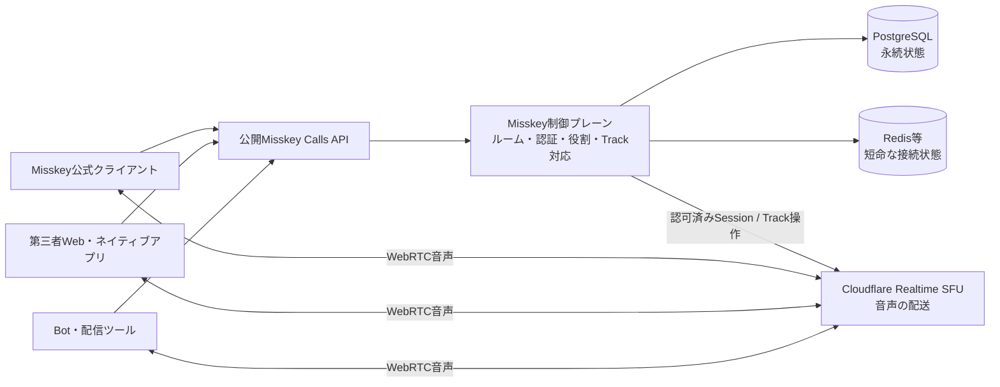
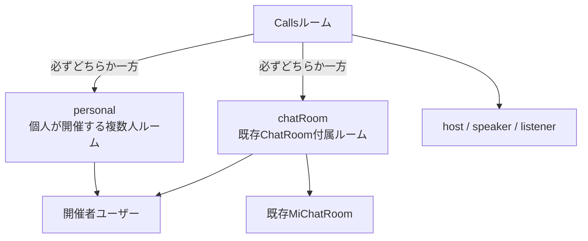
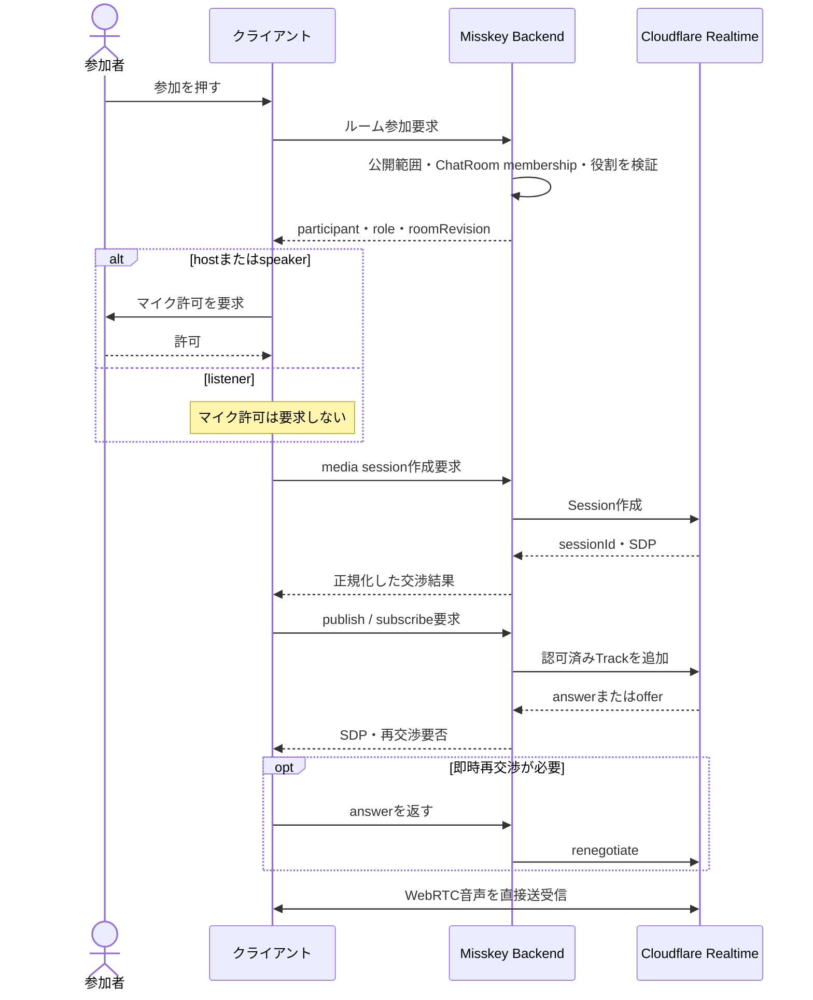
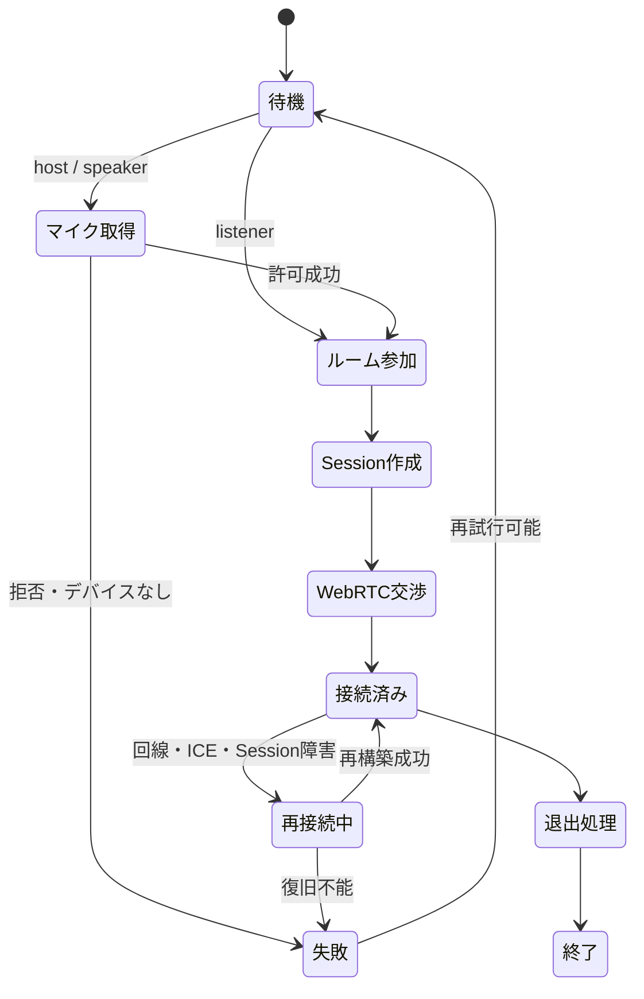
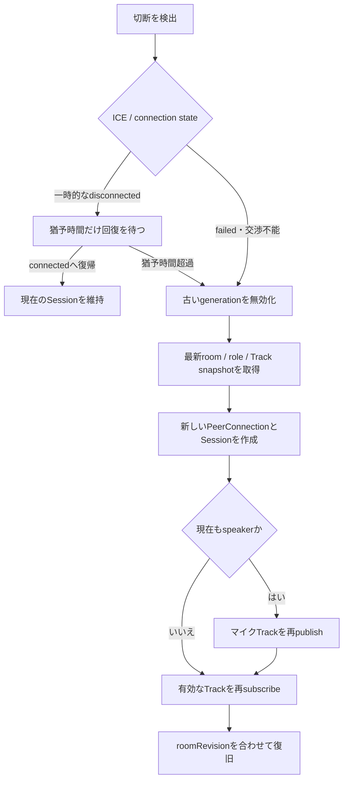
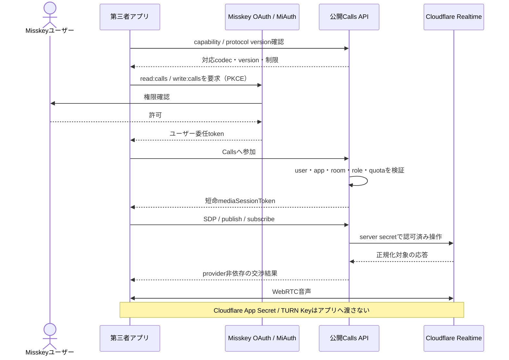
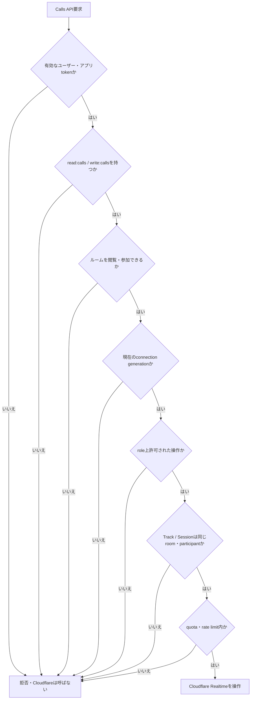

## Context（背景）

Misskeyには、個人間チャットと複数人の`ChatRoom`がすでに存在する。一方、Cloudflare Realtime SFUは意図的にroom、user、participant、presenceを持たず、Application、Session、Trackだけを提供する。Sessionは1つの`RTCPeerConnection`に対応し、Trackは`MediaStreamTrack`に対応するグローバルなpublish / subscribe単位である。そのためCallsの所属、認可、役割、参加状態、track ID配布、モデレーション、再接続はMisskeyが制御プレーンとして所有する。

本提案では、ユーザーが開催主体となる`personal`ルームと、既存`ChatRoom`の会話に付随する`chatRoom`ルームを提供する。「個人に紐づく」は1対1通話に限定せず、1人の開催者に紐づき複数のlistener / speakerが参加できるSpaces型のルームを意味する。

初期リリースは音声のみで、対応ブラウザは現行のChromeとFirefoxを必須とする。WebRTC実装差を吸収するため、標準API、Unified Plan、Opus、能力検出を共通線とし、UA判定、prefixed API、`addStream`、手書きSDP mungingを禁止する。

### 全体構成

重要なのは、音声データをMisskey backendへ通さない点である。Misskeyは「誰が何をしてよいか」を決め、実際の音声は各クライアントとCloudflareの間で送受信する。

### Callsルームの所属関係

### 外部仕様と参照資料

- Cloudflare Realtimeはroom/presenceを提供せず、アプリケーションが参加者とtrack IDを保存・配布する: https://developers.cloudflare.com/realtime/sfu/introduction/
- SessionはPeerConnectionと1対1、TrackはMediaStreamTrackと対応し、App内でグローバルにpull可能: https://developers.cloudflare.com/realtime/sfu/sessions-tracks/
- Connection APIはsession作成、track追加、renegotiate、track close、session取得を提供する: https://developers.cloudflare.com/realtime/sfu/https-api/
- 2026-07-11時点の公開制限は1 sessionあたり50 API calls/秒、1回64 tracks、sessionあたりのprovider固定track上限なし、無通信trackは30秒で回収、接続待ちは最大5秒。対応音声codecはOpusとG.711: https://developers.cloudflare.com/realtime/sfu/limits/
- TURN keyはserver-sideに保持し、TTL付き資格情報を生成する。ブラウザではport 53 URLがblockされる既知事項がある: https://developers.cloudflare.com/realtime/turn/generate-credentials/
- `getUserMedia`はHTTPS secure contextとユーザー許可が必要で、Chrome / Firefoxの共通標準APIである: https://developer.mozilla.org/en-US/docs/Web/API/MediaDevices/getUserMedia
- `setCodecPreferences`は現行主要ブラウザで共通化されているが、実際のcapabilitiesを並べ替え、RTX / RED / FECを落とさない必要がある: https://developer.mozilla.org/en-US/docs/Web/API/RTCRtpTransceiver/setCodecPreferences

## Goals / Non-Goals（目標と対象外）

**目標:**

- Twitter Spaces相当のhost / speaker / listener型ライブ音声ルームを作る。
- Calls roomの所属を`personal`または既存`ChatRoom`の排他的2種類として表現する。
- Misskeyの認証・ChatRoom membership・モデレーションをCloudflare media操作より先に強制する。
- ChromeとFirefoxで同一の参加、発言、mute、デバイス切替、切断復旧、退出フローを実現する。
- 公式Webクライアント以外のWeb、native、Bot、配信クライアントが同じ公開contractを実装して参加できるようにする。
- CloudflareのephemeralなSession / TrackとMisskeyのdurableなroom / roleを分離し、再接続可能にする。
- provider limit、費用、接続品質、障害原因を運用観測可能にする。

**対象外:**

- 初期リリースでの映像、画面共有、録音、文字起こし、音声加工、WebRTC DataChannelチャット。
- ActivityPub identityだけを使った無認証のリモートユーザー参加、他インスタンスSFUとのmedia federation。第三者ソフトウェアからローカルMisskeyアカウントまたは明示的Botアカウントとして参加することは対象内。
- E2EE Insertable Streams。SFUがmediaをforwardする通常のWebRTC暗号化（DTLS-SRTP）は利用するが、SFUからも不可視なend-to-end暗号化は別提案とする。
- PSTN / SIP接続、電話番号、配信アーカイブ、収益化。
- Cloudflare RealtimeKit SDKへの依存。Misskey固有のroom / roleモデルを保持するため、低レベルRealtime SFU APIを使用する。

## Decisions（設計判断）

### 0. 初期リリースのプロダクト境界

- `personal`は1対1 DM通話ではなく、1人のlocal userが開催する複数人のSpaces型ルームとする。
- personal roomのvisibilityは`public | followers | specified`を提供する。`public`は認証済みlocal userが検索・参加でき、`followers`は開催者をフォローするlocal user、`specified`は開催者が指定したlocal userだけが参加できる。未認証guestとremote actorはvisibilityにかかわらず参加できない。
- 1 roomの初期上限はhostを含むspeaker 8人、listener 100人とし、instance administratorがより小さい値へ設定できる。上限判定はroom join / role promotionのauthoritative transactionで行う。
- ChatRoom CallsはChatRoomのownerまたはmoderatorだけが作成でき、参加には現在のChatRoom accessを要求する。
- listenerからhostへのspeaker requestと承認queueを初期版へ含める。requestは発言権そのものではなく、hostが承認してrole revisionが更新された後だけpublishを許可する。
- Calls protocolの初期versionは`1.0`とする。第三者clientはOAuth 2.0 Authorization Code + PKCE、MiAuth、または明示発行API tokenを使い、`read:calls` / `write:calls`で認可する。
- 第三者applicationの初期default quotaは同時media session 10、同時published audio track 8とし、instance administratorがapp単位で縮小・停止できる。room / user / instance上限も別途適用する。
- Misskey accountを持たないguest invitationは無効とし、将来のversioned extensionとしてのみ追加する。

### 1. Calls roomをChatRoomから独立した集約として持つ

`MiCallsRoom`を新設し、`attachmentType`を`personal | chatRoom`とする。

| field | purpose |
| --- | --- |
| `id` | Misskey ID |
| `attachmentType` | `personal`または`chatRoom` |
| `ownerUserId` | hostとなるlocal user。両型で必須 |
| `chatRoomId` | `chatRoom`型のみ必須 |
| `title`, `description` | 表示情報 |
| `visibility` | personal型の公開範囲。ChatRoom型はChatRoom認可を優先 |
| `state` | `scheduled | open | ended | cancelled` |
| `scheduledAt`, `startedAt`, `endedAt` | lifecycle時刻 |
| `revision` | state / role更新の楽観ロックとevent reconciliation |

DB check constraintで、`personal`なら`chatRoomId IS NULL`、`chatRoom`なら`chatRoomId IS NOT NULL`を保証する。`ownerUserId`はCallsのhostと監査主体であり、personal型のattachmentでもある。ChatRoom型ではChatRoom削除時にCalls roomを削除せず、開催履歴を残して`ended`へ遷移させるか、FKを`SET NULL`にしてattachment snapshotを保持する。実装時にMisskeyのデータ保持方針と整合させる。

代替案: ChatRoomそのものにCalls stateを埋め込む。personal型を不自然に擬似ChatRoom化し、同じChatRoomで複数回開催した履歴を表せないため却下する。

### 2. durable participantとephemeral connectionを分離する

`MiCallsParticipant`は`roomId + userId`を一意にし、`role`、join / leave時刻、moderation状態を保持する。hostは必ず1人、speaker / listenerは昇降格可能とする。再参加では同じparticipantを再活性化する。

`CallsLiveConnection`は短命で、次を保持する。

- `participantId`, `connectionId`, 単調増加`generation`
- Cloudflare `sessionId`
- heartbeat / connection state / browser metadata
- local published track bindingとremote subscription binding
- 作成・最終確認時刻

live stateのsource of truthはRedis等のTTL付き共有stateを第一候補とし、Cloudflare IDを長期履歴として依存しない。PostgreSQLにはroom / role / moderation / lifecycleを保持する。単一プロセスmemoryは複数backend nodeで破綻するため使用しない。

代替案: すべてPostgreSQLへheartbeat書き込み。高頻度更新とcleanup負荷がdurable履歴へ混ざるため却下する。

### 3. Backend proxyを唯一のCloudflare API呼び出し元にする

ブラウザはCloudflare App Secretを持たない。Calls media endpointは通常のMisskey credentialで認証し、各requestでroom state、attachment access、participant role、connection generation、track ownershipを検証した後にCloudflareへforwardする。

track / session ID自体はsecretではないが、他人のIDをclose / pullできないようserver-side authorizationが必須である。入力IDを信用せず、`roomId + participantId + generation`からserver-held bindingを解決する。

Cloudflare呼び出しにはtimeout、bounded retry、idempotency keyまたはoperation ID、structured error mappingを持たせる。SDPは機密そのものではないがIP等を含み得るためログへ保存しない。

代替案: App Secretを短期tokenのようにbrowserへ渡す。Cloudflare App単位の権限が強すぎ、room認可を迂回できるため却下する。

### 4. APIをroom controlとmedia negotiationに分離する

想定するMisskey APIは次の責務へ分割する。最終endpoint名は既存命名規則に合わせる。

**Room control**

- `calls/rooms/create`, `show`, `list`
- `calls/rooms/open`, `end`, `cancel`
- `calls/rooms/join`, `leave`
- `calls/rooms/participants`
- `calls/rooms/set-role`, `remove-participant`

**Media control**

- `calls/media/session/create`: client offerまたはsession intentを受け、Cloudflare sessionを作る
- `calls/media/tracks/publish`: local audio offer / midを検証して登録する
- `calls/media/tracks/subscribe`: authorized track bindingをpullする
- `calls/media/renegotiate`: Cloudflare offerへのclient answerを渡す
- `calls/media/tracks/close`: publication / subscriptionを閉じる
- `calls/media/reconcile`: room revisionとauthoritative track snapshotを返す
- `calls/media/turn-credentials`: TURN有効時のみ短命ICE server設定を返す

すべてのmutationは`connectionId`, `generation`, `operationId`, 期待する`roomRevision`を持ち、stale requestと二重送信を検出する。

### 5. 参加フローを状態機械として実装する

Frontend stateは少なくとも次を持つ。

`idle -> acquiring-media -> joining-room -> creating-session -> negotiating -> connected -> reconnecting -> leaving -> closed`

任意の非terminal stateから`failed`へ遷移し、再試行可能な失敗と不可能な失敗を区別する。room membership成功とmedia接続成功を混同せず、UIは「ルームには参加済みだが音声接続中」を表現する。

初回参加:

1. UIがsecure contextと必須APIをcapability checkする。
2. speaker / hostだけが明示操作後に`getUserMedia({audio: ...})`を呼ぶ。listenerはマイクを要求しない。
3. backendへjoinし、participant roleとroom revisionを得る。
4. 1個の`RTCPeerConnection`を作り、必要なaudio transceiverをUnified Planで構成する。
5. backend経由でCloudflare sessionを作成し、local publication / remote subscriptionsを追加する。
6. Cloudflare responseに`requiresImmediateRenegotiation`があれば、remote offerを適用し、answerを生成・適用して`/renegotiate`へ返す。
7. `connectionState === connected`とauthoritative bindingsの一致後にconnected表示する。

Cloudflareがoffererになるpull操作とbrowserがoffererになるpublish操作が混在するため、negotiation operationを1 PeerConnectionあたり直列化する。`signalingState`を検証し、同時操作をqueueする。一般的P2Pのperfect negotiation思想は採用するが、相手はCloudflare HTTPS APIなので、polite / impolite peer signalingを独自に再現せず、Cloudflareの`requiresImmediateRenegotiation`契約を正とする。

#### 参加から音声接続まで

#### 参加状態の遷移

### 6. 音声codecとmedia constraintsを保守的な共通線にする

初期codecはOpusを必須とする。CloudflareはOpusを受け、ChromeとFirefoxのWebRTC audio共通線でもある。G.711はfallbackを必須にしない。

`RTCRtpReceiver.getCapabilities('audio')`から得た配列を基にOpusを先頭へ並べる。関連するRED / CN / telephone-event等を恣意的に削除しない。`setCodecPreferences`が無ければbrowser defaultを使い、answerのcodecを検証する。SDP textの正規表現書換えは禁止する。

初期`getUserMedia` constraintsはexact指定を避け、例として以下をidealにする。

- `channelCount: { ideal: 1 }`
- `echoCancellation: { ideal: true }`
- `noiseSuppression: { ideal: true }`
- `autoGainControl: { ideal: true }`

browser / OSがconstraintを無視・不対応でも失敗させない。取得後の`getSettings()`をtelemetryへ匿名化して記録し、UI上の実動作を優先する。

### 7. Chrome / Firefox差はcapability detectionと共通テストで管理する

| concern | common contract |
| --- | --- |
| Permission | HTTPS上で明示クリック後に`navigator.mediaDevices.getUserMedia` |
| Track handling | `addTransceiver`, `RTCRtpSender.replaceTrack`, `track` event |
| Codec | capability-derived Opus preference。UA別SDPなし |
| Autoplay | remote audioの`play()` rejectionを扱い、必要なら参加gestureから再開 |
| Device labels | permission前は空になり得る前提。permission後に`enumerateDevices` |
| Device change | `devicechange`をbest effortで扱い、選択device消失時に明示fallback |
| Connection | `connectionState`と`iceConnectionState`の双方を観測 |
| Stats | 共通fieldだけを正規化し、browser固有fieldはoptional |

最低サポートversionは、現行frontend build targetと2026-07-11取得のMDN Browser Compatibility Data 8.0.6から次の通り固定する。単に「最新版」とはせず、CI matrixとrelease noteにもこのmajor versionを残す。

| browser | minimum major | contract |
| --- | ---: | --- |
| Chrome | 116 | frontend build targetと同じ。必須Calls APIを標準名で利用する |
| Firefox | 116 | frontend build targetと同じ。`setCodecPreferences`はFirefox 128からのため、116–127ではbrowser default codecを使う |

必須経路のうち`getUserMedia`、`addTransceiver`、`replaceTrack`、`getCapabilities`、`connectionState`は両minimum versionで利用できる。`setCodecPreferences`はoptional enhancementとしてcapability detectionし、存在しない場合もOpusを含むbrowser / Cloudflare共通codec negotiationを継続する。

### 7.1 Cloudflare Realtime provider contract baseline

2026-07-11取得のCloudflare Realtime OpenAPI `2024-05-21`と公式limitsを`CloudflareRealtimeProviderContract`へ固定した。対象はsession create / show、track add / update / close、renegotiate、offer / answer、`requiresImmediateRenegotiation`、部分track errorである。

| limit | current value |
| --- | ---: |
| API calls | 1 sessionあたり50回/秒 |
| tracks per API call | 64 |
| tracks per session | provider固定上限なし（帯域による実用上限） |
| inactive track cleanup | 30秒 |
| connected待機 | 最大5秒 |

OpenAPIは`errorCode`を列挙せずopen-ended stringとしている。実装は未知のprovider codeを保持しつつ、HTTP 400 / 401 / 403 / 404 / 408 / 422 / 429 / 5xxをcanonical categoryとretry可否へ変換する。provider schemaとlimitは変更され得るため、更新時は取得日、schema version、contract fixtureを同時更新する。

### 8. reconnectは新Session + authoritative reconciliationを基本にする

`disconnected`は一時的になり得るため短いgrace period中は現PeerConnectionを維持する。`failed`、Cloudflare APIのunrecoverable negotiation error、30秒track inactivity超過、またはgrace超過では次を行う。

1. old generationをbackendで無効化する。
2. old PeerConnectionとlocal trackをclose / stopする。
3. room snapshotと有効なspeaker track一覧を再取得する。
4. generationを増やし、新Session / PeerConnectionを作る。
5. roleがspeakerなら新しいlocal microphone trackをpublishする。
6. current track snapshotへsubscribeする。
7. room revision gapを解消してconnectedへ戻る。

Cloudflare trackは30秒無通信で回収されるため、古いIDを再利用可能と仮定しない。heartbeatはpresence検出でありmedia packetの代替ではない。

### 9. role変更とmuteをserver-authoritativeにする

local muteは低遅延のため即時に`MediaStreamTrack.enabled = false`とし、room eventでmute stateを同期する。帯域・privacyをより強く止めるモードではsenderのtrackを`replaceTrack(null)`またはCloudflare track closeとするが、unmute時のrenegotiation負荷とのtrade-offを実装検証する。

demote、remove、logout、room endはclient協調に依存せずbackendがbindingを無効化してCloudflare trackをcloseする。その後のold generation操作は拒否する。

### 10. presence / signalingは既存Misskey streamingを使う

room state、participant join / leave、role、mute、speaking、track available / unavailable、reconcile-requiredをCalls room専用stream channelで配信する。media自体はCloudflareを通し、Misskey WebSocketへ流さない。

eventは`roomRevision`と`eventSequence`を持つ。gap、再接続、stream再購読時はREST snapshotを取り直す。speaking indicatorは高頻度なので永続化せず、rate limit / coalescingする。

代替案: Cloudflare DataChannelだけでpresenceを配る。DataChannel subscription前の初期event loss、authorization、既存streamとの二重接続、server-side moderationが複雑になるため初期版では却下する。

### 11. TURNはfallbackとしてserver-issued credentialsを使う

Cloudflare Realtime SFUはpublicly routable endpointのため多くの場合TURN不要だが、企業network等の接続性を担保するためoptional fallbackを設ける。

- TURN key / API tokenはsecret managerまたはMisskey configにserver-sideで保持する。
- user / connection単位の短命credentialを生成する。
- TTLは最大想定通話時間 + refresh余裕に制限する。
- `turn.cloudflare.com`のUDP / TCP / TLS URLを使用する。
- Cloudflare docsがbrowserでtimeoutすると明記するport 53 URLは、非trickle設計では除外する。
- expiry前に新credentialを取得し`pc.setConfiguration()`で更新する。
- revoke / user removal時の挙動を統合testする。

TURNはSFU接続の基本要件ではなく、ICE candidate / selected pair telemetryに基づいて必要性と費用を評価する。

### 12. セキュリティとプライバシー

- APIごとにMisskey credential、room access、role、ownership、generationを検証する。
- personal public roomのmetadata閲覧とmedia参加token取得を分離する。
- create / join / publish / subscribe / role mutationへuser・IP・room単位rate limitを置く。
- title / descriptionは通常のMisskey sanitizationを通す。
- App Secret、TURN key、短命credential、SDP、ICE candidate raw値をlogへ残さない。
- `Permissions-Policy: microphone=(self)`を基本とし、埋め込みを許可する場合だけ明示originを追加する。
- room end / removalでserver-side bindingを即時revocationする。
- Cloudflare track IDが漏れてもbackend endpoint経由の認可なしに操作できない構成にする。
- moderation actionはactor、target、room、before / after role、reason、timeを監査する。

### 13. 可観測性とSLO入力値

room / participant単位で以下をwide event化する。

- join開始からpermission、session作成、ICE connected、first remote audioまでのlatency
- Cloudflare endpoint、status、error code、retry、duration
- browser family / major version、OS family、connection generation
- signaling / ICE / connection state transition
- selected codec、candidate type（host / srflx / relay）、protocol
- inbound / outbound bitrate、packets lost、jitter、RTT、audio level
- reconnect count、reason、success、time to recover
- active session / published track / subscription countとegress estimate

raw SDP、candidate address、credential、media内容は含めない。初期SLO値はdogfood測定後に別途確定するが、少なくともjoin success rate、p95 join latency、unexpected disconnect rate、Chrome / Firefox差分をdashboard化する。

### 14. provider limitを固定知識ではなく設定として扱う

2026-07-11時点では50 API calls/sec/session、64 tracks/API call、30秒track inactivity、connected待ち5秒が公開されている。これらをcodeに散在させずprovider policy moduleへ集約し、コメントに参照URLと確認日を残す。CIまたはrelease checklistで現行docsを再確認する。

初期版はaudio-onlyで1 speaker = 1 published track、各participantの1 Sessionがactive speaker tracksをpullする。listenerが多い場合、Cloudflare egressは概ね`各audio bitrate × subscriber数 × 時間`で増えるため、roomごとの最大speaker数、同時participant数、subscription batchingをconfigurableにする。

### 15. サードパーティー参加は公開Calls protocolとして提供する

公式frontendだけが呼べるprivate endpointを作らず、room control、media negotiation、event購読を公開Misskey APIとして定義する。サードパーティーはCloudflare APIを直接呼ばず、Misskey endpointを通じて以下を実行する。

1. instanceのCalls capabilityとprotocol versionを取得する。
2. OAuth 2.0 Authorization Code + PKCE、MiAuth、または明示的に発行されたAPI tokenでユーザー認可を得る。
3. `read:calls`でroom metadata、participant snapshot、authorized eventを読む。
4. `write:calls`でjoin / leave、media session作成、publish / subscribe / renegotiateを行う。
5. serverが発行する短命な`mediaSessionToken`を各connection generationへbindし、Misskey user tokenをWebRTC negotiation payloadやCloudflareへ渡さない。

第三者アプリは常に認可したMisskey userとして参加する。常駐Botやbridgeは専用のlocal Botアカウントと最小scope tokenを使い、client credentialsだけで任意ユーザーを偽装できない。将来guest参加を追加する場合は、room-bound・短命・失効可能・listener初期値のinvitation credentialとして別途仕様化する。

`mediaSessionToken`はopaqueまたは署名済みで、少なくともinstance、room、participant、connection ID、generation、許可media kind、publish可否、expiry、nonceへbindする。再利用、別room転用、権限昇格を拒否する。これはCloudflare credentialではなくMisskey APIの限定credentialである。

代替案: Cloudflare App Secretやsession APIを第三者へ直接公開する。room認可、scope、失効、監査を迂回するため却下する。

### 16. protocolは実装非依存かつversion付きにする

公開contractには次を含める。

- OpenAPIから生成可能なroom / participant / negotiation endpoint schema
- Calls streaming channelのevent envelope、`roomRevision`、`eventSequence`
- `GET`相当のcapability discovery: `callsProtocolVersion`、audio codec、media kind、role、room limit、TURN可否、guest可否、extension一覧
- Cloudflare固有IDをopaqueとして扱うpublish / subscribe / renegotiate state machine
- canonical error code、retryability、idempotency、expiry、rate-limit response
- misskey-jsの型とreference client helper
- Pion / libwebrtc等の非browser WebRTC実装でも検証できるwire-level example

breaking changeはprotocol major versionを上げる。additive field / eventはminor extensionとして追加し、clientは未知fieldを無視する。serverは参加開始時にclientのsupported versionと必要extensionを検証し、不一致をnegotiation途中ではなく事前に返す。

Cloudflare provider contractを直接public contractにしない。Misskey APIがprovider差を吸収し、将来SFUを交換しても第三者参加protocolを維持する。

### 17. 第三者event配信とabuse control

低遅延のroom updateは認可済みMisskey streaming channelで配信し、切断時はsnapshot + sequence reconciliationを使う。第三者webhookへの外部送信は初期版に含めず、必要なら署名、再送、SSRF防止を伴う別capabilityとする。

アプリID / token IDをparticipant connectionと監査eventに記録し、user、app、room、instance単位でrate limitと同時session上限を適用する。hostは第三者クライアント経由のparticipantも公式clientと同様にmute、demote、removeでき、token revoke時は対応するmedia sessionを終了する。

### 19. 権限判定の順序を固定する

### 18. 第三者conformance suiteを出荷条件にする

reference clientだけが偶然動く状態を避けるため、providerをmockしたprotocol testsとstaging Cloudflareを使うconformance testsを用意する。最低限、OAuth / scope拒否、capability negotiation、listener join、speaker publish、remote subscribe、renegotiate、sequence gap、token expiry / revoke、reconnect、cross-room attackを検証する。

公式Chrome / Firefox clientも同じ公開contractを通すことで、第三者だけが使う未検証経路を作らない。

## Risks / Trade-offs（リスクとトレードオフ）

- [「個人に紐づく」の意味が1対1通話を意図していた可能性] → 本提案はSpaces型の個人開催ルームとして定義した。実装前にproduct decisionとして確認し、1対1通話が必要ならvisibility / admission policyとして追加する。
- [Cloudflareの低レベルAPIはroom SDKより実装量が多い] → negotiationを専用client / serviceへ隔離し、contract testとprovider fixtureを持つ。
- [Offer / answer競合でChromeとFirefoxの挙動差が出る] → 1 PeerConnectionごとにoperation queueを設け、signaling stateをassertし、両browserの実SFU E2Eを必須にする。
- [Cloudflareのtrack timeoutでUIだけ残る] → track unavailable event、heartbeat、periodic reconcile、新Session recoveryを実装する。
- [Redis live state消失] → room / roleはPostgreSQLから復元し、全clientをnew generationで再接続させる。ephemeral IDの完全復元は狙わない。
- [多数listenerでegress費用が増大] → room limit、usage meter、budget alert、listener subscription数の観測を追加する。
- [TURN fallbackが接続時間や費用を増やす] → selected candidate telemetryで利用率を測り、short-lived credentialと必要時のみの設定にする。
- [公開media APIがabuseや費用増加の入口になる] → app/user/room quota、short-lived media token、scope、idempotency、同時session上限、監査、緊急失効を設ける。
- [Cloudflareの生APIを公開contractにするとprovider変更できない] → Misskey固有のversioned negotiation contractで包み、Cloudflare IDとresponseをopaque / normalizedにする。
- [第三者実装がeventやrenegotiationの一部だけ対応して壊れる] → capability handshake、protocol version、canonical state machine、conformance suiteを必須にする。
- [Muteを`enabled=false`だけにすると無音packetが継続し得る] → privacy表示は即時、帯域削減はtrack close方式を比較し、要件に応じて選ぶ。
- [ChatRoom membership変更とCalls roleが競合する] → 各media operationで現在membershipを再検証し、membership revoke eventでconnectionを無効化する。
- [Browser permission promptが永遠にpendingになり得る] → cancellable UIと明示的なtimeout案内を用意し、backend参加成功扱いにしない。

## Migration Plan（導入とrollback）

1. Cloudflare Realtime Appをstaging / productionで分離し、App IDとsecretをserver-side secretとして設定する。TURNはfeature flag配下で別keyを作る。
2. 新規migrationでCalls room / participant / moderation履歴を追加する。既存migrationは変更しない。`up()` / `down()`と`check-migrations`を検証する。
3. backendのdomain / authorization / provider client / streamingをfeature flag付きでdeployする。flag offではendpointを公開しない。
4. misskey-jsを再生成し、frontendのcapability check、permission、negotiation、reconnect UIを追加する。
5. stagingでChrome stable / Firefox stableの2 browser・2 client以上、speaker昇降格、network切替、TURN強制、room endをE2Eする。
6. reference third-party clientとconformance suiteを公開contractに対して実行し、OAuth revokeとapp quotaを検証する。
7. internal usersと限定されたthird-party appへ段階公開し、join success、reconnect、packet loss、egress、app別abuse signalを監視する。
8. 問題時は第三者アプリ単位またはCalls全体の新規session作成をflagで停止し、open roomをserver-side end、trackをcloseする。DB migration rollbackはデータ消失を伴うため通常はtableを残し、code rollbackを優先する。

## Open Questions（実装前に決めること）

- 「個人に紐づくルーム」は本提案のような1人が開催する複数人Spacesか、特定2ユーザー間のDM通話か。現提案は前者。
- personal roomのvisibilityを`public / followers / specified`のどこまで初期対応するか。
- ChatRoom roomを作成・開始できるのはownerだけか、全memberか、個別権限か。
- listenerのspeaker request / approval queueを初期版に含めるか。
- 1 roomあたりspeaker / listener上限と、instance administratorのquotaをいくつにするか。
- ephemeral live stateに既存Redisを使うか、新しい保存層が必要か。
- local muteを`track.enabled=false`で維持するか、Cloudflare publication closeで帯域を止めるか。
- TURNを初期から常時ICE serverへ含めるか、接続失敗時のfallbackとして再接続するか。
- Calls公開情報をActivityPubへannounceするか。media参加のfederationとは分離して別仕様にする。
- 初期公開SDKをmisskey-jsだけにするか、Pion / native向けreference implementationも同時提供するか。
- third-party appごとの同時session、publish track、egress quotaをinstance administratorがどう設定するか。
- 将来、Misskeyアカウントを持たない招待guestを許可するか。初期版は認可済みlocal user / Bot accountに限定する。
