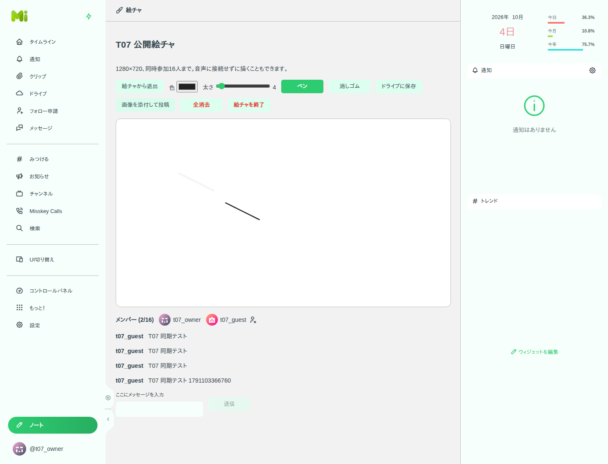
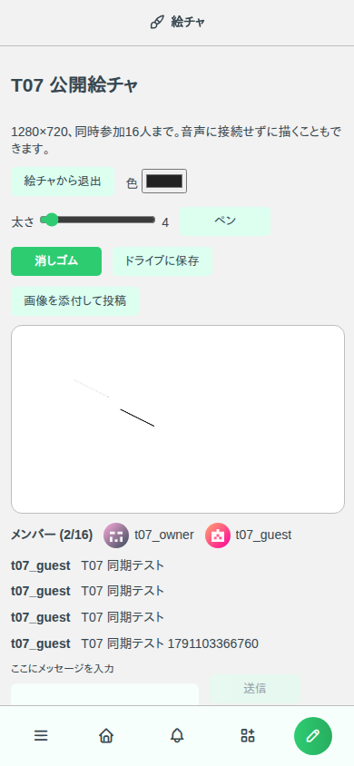

# T07 動作確認

2026-10-04、Calls の `d1f0e95cfb0ba67cf44e2e047fb83a5d5d9b815b` を基点とした専用 worktree で検証。専用 PostgreSQL 18 / Redis 7、ローカル Misskey、Chromium の独立した2つのログイン状態を使用した。

| 検証 | 結果 |
| --- | --- |
| DrawingService unit（同期、権限、消去・終了、参加枠、ChatRoom、Calls 接続） | PASS: 6件 |
| `pnpm --filter backend test:e2e --run test/e2e/calls.ts` | PASS: 8件。Calls 有効の試験設定で公開キャンバスの lifecycle も実行 |
| backend / frontend typecheck | PASS |
| `pnpm build-misskey-js-with-types` | PASS |
| frontend build | PASS |
| 変更ファイルの `eslint --quiet` / locale safety | PASS |
| SPDX 全体検査 | BASELINE: 基点にある migration 2件のヘッダー欠落。今回の追加ファイルは欠落なし |

ブラウザーでは次を確認した。2人がマウスで描画した後のキャンバス画像が一致し、再読込でも一致する。消しゴムと文字チャットが相手へ反映される。全消去をキャンセルすると線が残り、確定すると両画面で白紙になる。PNG をドライブに保存すると 1280×720 の画像が作られ、投稿フォームには画像が添付される。投稿は実送信しない。390px 幅でもキャンバスが画面内に収まる。ホストによる退出で相手の画面と API のアクセスが拒否され、終了後は描画が無効になり保存は有効のままになる。ページの未処理 JavaScript エラーは0件。

API では ChatRoom の招待・参加から絵チャを開き、外部ユーザーの拒否、既存 ChatRoom 文字チャット、退室後の取得・描画拒否を確認した。Calls 限定では試験用の有効な participant / Redis 接続状態を用い、接続ありのホストだけが開始・取得でき、未接続メンバーと接続失効後のホストは拒否されることを確認した。

Cloudflare の実音声接続は試験用認証情報のため SKIPPED。既存の音声・映像処理は変更していない。Redis の再起動後の保持は既存の永続化設定に依存する。

SPDX の既存違反は `packages/backend/migration/1774789240317-event.js` と `packages/backend/migration/1778352600000-hashtagFollowing.js`。マージ済 migration は変更していない。

