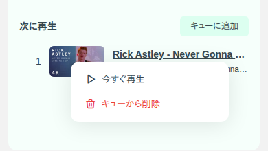

# Watch Together 動作確認

2026-10-06、Activity の土台 `codex/calls-activities`（PR #76、`eee7ed4786`）をベースに実装。絵チャ PR #34 への依存はない。

Calls の閲覧権限を持つユーザーが、ルーム内 Activity から YouTube を視聴する。動画の変更・再生・停止・シークはホストと有効なルームモデレーターに限定する。既存のインスタンスモデレーター権限も維持する。視聴者の音量と再生許可は本人だけに作用する。動画ID、再生状態、位置の基準時刻、revision を Redis に7日間保持し、Calls の既存 streaming とロックを使う。音声に接続せず視聴しているホストも、30秒ごとの状態取得で在席期限を更新する。

- PASS: backend unit 99件（Watch Together 5件、CallsRoomChannel 6件、CallsRoomService 88件）、Calls API e2e 6件（Watch Together 2件を含む）。ホスト・有効なモデレーターの操作、視聴者の操作拒否、非公開ルーム・退出処分・OAuth権限、途中参加・古いrevision・終了時の停止を確認。
- PASS: frontend Calls unit 60件（URLの検証、視聴者の同期、ホスト操作、プレーヤーの解放、ローカル再生許可を含む）、backend / frontend typecheck、SDK再生成、i18n build、frontend build、アイコン・Storybook登録生成、変更ファイル lint・SPDX・locale safety。
- PASS: 専用サーバー（localhost:61917、専用PostgreSQLとRedis）と独立した2ブラウザーで、実際のYouTube IFrame APIと動画を使用。動画選択、再生、30秒へのシーク、一時停止を確認し、両プレーヤーの再生位置差は3秒未満だった。390px幅で動画が収まり、ページの未処理JavaScriptエラーは0件。
- PASS: 同じローカルAPI・streamingに決定的なYouTubeプレーヤーfixtureを接続し、再表示時の位置復元、視聴者の操作拒否、モデレーター任命後の操作、ルーム終了時の停止を確認。未処理JavaScriptエラーは0件。

2026-10-06、UIをYouTube標準のボタン・タイムライン・音量操作に変更。独自の再生ボタン・秒数入力・音量スライダーを削除し、URL入力は動画の選択・変更時だけ表示する。

- PASS: 実際のYouTubeプレーヤーを独立した2ブラウザーで操作し、標準の再生・一時停止ボタン、停止中のタイムラインを30秒へシークする操作がAPI・streamingを通じて同期した。視聴者の標準操作は共有更新を送らず、モデレーター任命後は標準の一時停止操作がホスト側にも反映された。
- PASS: 1360×900と390×844で表示を確認。スマホ幅で動画のはみ出しなし、プレーヤー高さ200px以上。未処理JavaScriptエラー0件。
- PASS: frontend Calls unit 60件、frontend typecheck・build、変更ファイルlint・SPDX・locale safety。今回backend/APIの変更はないため、その検証とSDK生成は再実行していない。

2026-10-07、検索一覧は追加せず、URL入力から「今すぐ再生」と「キューに追加」を選ぶ形に変更。キューは動画IDの配列を既存のRedis状態に保持し、同じrevision・ロック・streamingで共有する（最大50本）。ホスト・モデレーターが削除・任意の動画への切り替えを行い、再生終了時は操作権限者の開いているプレーヤーが次の動画へ進める。

- PASS: frontend Calls unit 61件、backend Watch Together / channel unit 12件、Calls E2E 6件。キュー追加で再生が変わらないこと、共有・操作権限、選択とキュー削除の同時更新、終了時の自動送りを確認。
- PASS: backend / frontend typecheck、SDK再生成、i18n build、frontend build、変更ファイルlint・SPDX・locale safety。
- PASS: 実YouTubeと2ブラウザーで、キューの共有・現在の動画を中断しない追加・モデレーターによるキュー選択と両プレーヤーの切り替え・実際の再生終了による自動送りを確認。1360×900と390×844で表示を確認し、未処理JavaScriptエラーは0件。
- CI修正: CI用設定ではCallsが無効で、既存のWatch Together E2Eがルーム作成に失敗していた。音声を外部へ接続しないテスト用のCalls設定を`.github/misskey/test.yml`へ追加した。

2026-10-07、キューのカードにサムネイル・タイトル・説明文を表示。既存の`/url`リンクプレビューを使い、検索APIやAPIキーを追加していない。リンクプレビューが無効・取得失敗の場合はURLと取得失敗の表示に切り替える。

- PASS: frontend 61件、型チェック・build、lint・SPDX・locale safety。既存のキューテストでタイトル・説明文の表示も確認。
- PASS: 実際のYouTube動画のタイトルと説明をローカルサーバーから取得し、デスクトップ・スマホ幅で表示を確認。両スクリーンショットを差し替えた。
- BASELINE: Storybook登録の生成は完了。事前処理の`.storybook/main.ts`に既存のStorybook/Vite型エラーがあり、Storybook本体の検証は未実施。

2026-10-07、キューのタイトルと説明文をそれぞれ1行の省略表示にし、行内の「今すぐ再生」・削除ボタンを右クリック・長押しのコンテキストメニューへ移した。

- PASS: frontend Calls unit 62件、frontend型チェック・build、変更ファイルlint・SPDX・locale safety。視聴者にはキュー操作メニューを出さないことも確認。
- PASS: 実YouTubeとローカルAPI・streamingで、右クリックからの即時再生、スマホのタッチ長押しからの削除を確認。長押し後にリンクへ遷移せず、通常のタップではリンクが開く。未処理JavaScriptエラー0件。
- PASS: 1360×900・390×844で、タイトルと説明文のnowrap・ellipsisとキューの幅を確認。スクリーンショットを更新し、長押しのメニュー表示も追加した。

広告ブロックは含めていない。[YouTube標準の埋め込みパラメーター](https://developers.google.com/youtube/player_parameters)には広告を無効化する機能がなく、親ページからiframe内の通信を制御できない。

YouTubeの埋め込み制限・地域制限・広告・ブラウザーの自動再生制限の影響は受ける。自動再生が止められた場合は「再生を許可」を表示する。実音声のCloudflare接続は試験用認証情報のため未検証。DB entity・migrationの変更はない。

